# Executive Summary

Diagnosing an EDK II PEI dispatcher hang (index 2) without live debugging requires an **offline, static analysis** of the firmware image. The approach is to extract and inspect all PEI modules from the Coreboot ROM (CBFS), identify their entry points, symbols and dependencies, and look for known hang causes. We recommend using **cbfstool** to list and extract files from the `coreboot.rom` image, then tools like `readelf`, `objdump`, `llvm-objdump` and `strings` on each PEIM to gather entry-point addresses, relocation data, imported GUIDs/protocols, and any suspicious MMIO/I/O patterns. Key checks include missing relocation sections (PEIMs are normally linked at base 0 and require relocations if loaded elsewhere), unresolved imports, and direct hardware accesses (PCI, HECI, SPI, etc.) that may fault when hardware isn’t initialized. We also highlight that **direct VGA text writes** (`0xB8000`) often fail on modern hardware (no mapping to real VRAM), so avoid these. 

Below is a structured plan of action with commands, parsing tips, and examples. We include tables summarizing discovered modules and their attributes, as well as Mermaid diagrams illustrating analysis flow and a timeline of steps. Actionable next steps and patch suggestions are provided to prepare for the actual debugging session when hardware access is available.

## 1. Extract Coreboot CBFS and List Contents

Use **cbfstool** to inspect the Coreboot firmware image. The Coreboot ROM (`coreboot.rom`) uses an FMAP; the main CBFS region is typically named “COREBOOT”. To list all files in the CBFS:

```bash
cbfstool coreboot.rom -r COREBOOT print
```

This command (or simply `cbfstool coreboot.rom print` by default) will output a table of CBFS files including names, offsets, sizes and types. For example, it might show entries like:

| **File Name**      | **Offset** | **Size**  | **Type**   |
|--------------------|------------|-----------|------------|
| BOOTBLOCK          | 0x0000000  | 0x001000  | bootblock  |
| CBFS HEADER        | 0x0001000  | 0x000100  | cbfs header|
| COREBOOT           | 0x0001100  | 0x0F00000 | cbfs header|
| **PEI Core (EFI)** | 0x0050000  | 0x020000  | simple_elf |
| PEIM_X             | 0x0080000  | 0x010000  | simple_elf |
| …                  | …          | …         | …          |

*(Table format: name, offset in CBFS, size, type.)* 

After listing, extract each relevant file (especially the PEI firmware volume or PEI modules) to the host filesystem:

```bash
cbfstool coreboot.rom -r COREBOOT extract -n <Filename> -f <Filename>.bin
```

For example, to extract “PEI Core (EFI)”:

```bash
cbfstool coreboot.rom -r COREBOOT extract -n "PEI Core (EFI)" -f pei_core.efi
```

You can also extract all files in a loop (e.g., via parsing `cbfstool print` output). Store them in a directory (`peim_extracted/`) for analysis. 

**Citation:** The `print` and `extract` commands are documented in the cbfstool manual and shown in usage examples.

## 2. Analyze Each PEI Module

For each extracted PEIM (often labeled *.efi or *.bin), gather the following via command-line tools:

- **Entry Point & Base:**  
  ```bash
  readelf -h module.efi | grep "Entry point"
  readelf -l module.efi | grep "LOAD"
  ```
  This shows the entry-point address and load base. EDK II PEIMs are typically linked at base 0, requiring relocations if run elsewhere.

- **Symbols and Imports:**  
  ```bash
  objdump -t module.efi      # symbol table
  objdump -x module.efi      # headers, including dynamic symbols/relocs
  objdump -R module.efi      # (for ELF) relocation entries
  ```
  Look for GUIDs or global protocol symbols (e.g. `gEfi...Guid`) and any undefined symbols. For GUIDs, you can `strings module.efi | grep -E '(EFI_)'` or grep for known GUID fragments (e.g. `{E4F1A0AC-...}`) to identify imported PPIs or protocols.

- **Relocations:**  
  Confirm each module has relocation entries (PE32+ sections). A missing relocation section can cause it to load incorrectly. The UEFI PI spec notes that position-dependent PEIMs must contain relocations. If no relocations are present, the PEIM may fail or be rejected by some firmware. Check with:
  ```bash
  llvm-objdump -r module.efi | head -20
  ```
  or similar. 

- **Imports/Dependencies:**  
  Use `strings` or `grep` on the disassembly to find calls to hardware accessors or PPIs:
  - GUID searches: look for occurrences of common PPI GUIDs (e.g. Memory Init, HECI, CPU I/O). 
  - Functions/macros: search for `MmioRead32`, `MmioWrite32`, `IoRead8`, `IoWrite8`, `CpuIo*`, `PortWrite`, etc., to see if it touches PCI/IO space.
  - Search for `Heci`, `SPI`, `PCI`, `I2C`, `USB`, or vendor-specific strings (e.g. `Intel`, `HECI`). 
  - Look for spin loops: strings like `Spin`, `Delay`, `MICROSECOND`, or suspicious infinite loops.
  - Check for BIOS table access: occurrences of `0xB8000`, `0xB0000` (VGA), or interrupt usage.

- **MMIO and PCI patterns:**  
  Specifically grep for numeric constants related to PCI addresses. For example, Intel HECI is typically at bus 0, device 22 (0x16) on PCH. The PCI config base of HECI might appear as a constant (e.g. `Bus=0x0, Dev=0x16`). Some modules hardcode offsets like `0x40`.  
  ```bash
  objdump -d module.efi | grep -n -E "mov .*,\[.*(b8000|0x40|0xFEE0|0xFED1)" 
  ```
  This can reveal direct memory writes (e.g. APIC, LAPIC at FEE00000, or PCI config space via port 0xCF8). Also search for known I/O port writes to VGA registers (0x3D4/0x3D5).

- **Linking info:**  
  If available, compare with EDK II map files. The map might list each module’s entry function address under an alias (e.g. `PeimEntryPoint`). If you have access to the EDK build files or symbol map for Sapphire Rapids FSP, use it to correlate addresses.

Collect these details into a table. For example:

| **PEIM File** | **Entry Point (virt)** | **Linked Base** | **Relocs** | **Key GUIDs/PPIs**           | **Notable IO/MMIO**         |
|---------------|------------------------|-----------------|------------|-----------------------------|-----------------------------|
| MemoryInit.efi | 0x1000100             | 0               | PE32+ (yes) | {EFI_PEI_IA32_ARCH_PROTOCOL}  | Writes DRAM controller regs |
| HeciPeim.efi  | 0x2000200             | 0               | PE32+ (yes) | {gEfiHeciProtocolGuid}      | PCI config 0x40 (HECI)      |
| SpiInit.efi   | 0x3000300             | 0               | PE32+ (yes) | {gEfiSpiHostControllerGuid} | MMIO writes to SPI registers |
| Unsupported.efi | 0x4000400           | 0               | PE32+ (yes) | {gSomeOtherPpi}             | GPIO or LPC IO writes       |
| VGA_DEBUG.efi | 0x5000500             | 0               | PE32+ (yes) | {gEfiGraphicsOutputProtocolGuid} | Writes to 0xB8000          |

*(Columns: extracted file name, entry, linked base, relocation info, referenced GUIDs/PPIs, observed hardware accesses.)*

No actual images are embedded here, but you may picture each PEIM as a row in such a table. These details help pinpoint which module corresponds to “index 2” (the hang) and what it is doing.

## 3. Map PEIM Entry Addresses to Dispatcher Index

The hang at “index 2” likely means the **third PEIM** discovered and dispatched. However, without running firmware, we must correlate static addresses with runtime indices. Typical approaches:

- **Default Load Base:** Many PEI modules are either XIP (run in place in flash) or loaded at a fixed base (e.g. 1MB) by the loader. If using FSP, it may relocate images to a common CAR address. Common assumptions:
  - Identity: each PEIM runs at its flash offset (rare).
  - Relocated to a fixed PEI heap (often 0x70000 or similar).
  - Use the image’s own “linked base” (usually 0) then relocated in-memory.

- **Search for EntryPointer:** Given an entry address from `readelf`, search `coreboot.rom` (e.g. with `hexdump` or `grep`) for that byte sequence. For example:
  ```bash
  objdump -d --adjust-vma=<LinkedBase> module.efi | head -20
  ```
  Then search the rom: 
  ```bash
  strings -t x coreboot.rom | grep "<entry_address_hex>"
  ```
  or 
  ```bash
  hexdump -C coreboot.rom | grep "xx xx xx xx"  # where xx are bytes of the entry address
  ```
  Match to find where the image is placed. The offset inside the FV plus any top-align hints gives the runtime pointer.

- **Use Map Files (if available):** If you have the EDK II or coreboot build map for this board, look up symbol addresses of known PEIM entry functions to cross-reference. The dispatcher index corresponds to the order in which the FVs are scanned (often the order in the FV, or by Apriori GUID). In many systems, PEIMs from the first firmware volume are dispatched sequentially by build order.

- **Coreboot CBFS ordering:** Often, CBFS packing order is how they appear. In the table from step 1, count the PEI modules. The third PEIM listed (Index 2) is suspect.

The key is to **identify the module hung**. Once you guess which file is “index 2”, focus on its analysis from step 2.

## 4. Static Checks for Common Hang Causes

Search each PEIM binary for telltale patterns of known issues:

- **Missing Relocations:** Verify `.reloc` or relocation section exists. If stripped, the firmware may drop or mis-load it.
- **Unresolved Imports:** If a PEIM imports a PPI/GUID that isn’t provided (no matching PPI installed), it may wait indefinitely. In the disassembly, look for calls to `PeiServicesInstallPpi` or `LocatePpi`. Also grep for GUIDs of common PPIs (MMIO, CPU architecture, GPIO, etc.) and check if any are missing from others.
- **MMIO/PCI Access:** Grep disassembly for hardware I/O. For example, look for MOV instructions to `[0x??b8000]` (VGA), IO ports (0x3x?), or PCI config accesses. Example grep patterns:
  ```bash
  objdump -d module.efi | grep -E 'mov\s+\w+,\s*\[0x[0-9A-F]+'
  strings module.efi | grep -E 'MmioWrite32|MmioRead32|IoWrite|IoRead'
  ```
  If the module touches **SPI flash (e.g. dual-rank memory accesses, HECI, or PCH registers) before those buses are enabled, it may hang**. For example, accessing the SPI controller or HECI bus before FSP/H/W readiness can freeze. Intel’s docs note FSP can hang if PCH devices are absent or disabled.
- **HECI/SPG/OEM Channels:** Search for “HECI”, “Heci”, or the HECI GUID. Modules trying to send messages to Intel ME via HECI may block if ME isn’t up. Similarly, look for TPM, TXE, or ME-related calls. 
- **Spin/Delay Loops:** Strings or code patterns with “Spin”, “Stall”, `GetTimeInNanoSecond`, or loops that poll status registers (e.g. waiting for a bit in an MMIO register). Disassemble and check loops that have no obvious exit. 
- **AP/CPU Sync:** On MP systems (`CONFIG_PARALLEL_MP=y`), some PEIMs may wait for all APs or signal fences. Search for “InitializeMpid” or “WaitForAPs”. 
- **Module-Specific Known Issues:** Research the module by name/GUID. For example, if the suspected PEIM is Intel’s CPUInit or SystemAgent, check Intel or EDK issue trackers for known bugs (e.g. missing address fix-ups, etc.). The coreboot FSP documentation lists known hangs (like certain hidden PCI devices hanging memory init).

Record any suspicious findings in the PEIM table (from step 2). 

## 5. Detect Unsafe VGA Writes

As noted, writing to video text buffer `0xB8000` may fault or be invisible on modern UEFI systems. In static analysis, check for this pattern:

```bash
grep -a -n "0xB8000" *.efi
```

Or search disassembly:

```bash
objdump -d module.efi | grep -E 'mov .*0xb8000'
```

If found, that indicates unsafe debug output. The StackOverflow discussion points out that on newer hardware, **“the frame buffer isn’t actually at 0xb8000. If you write to that area nothing happens.”**. Instead, use UEFI `DEBUG()` or serial output. 

Also search for direct port writes to 0x3D4/0x3D5 or other VGA registers (classic VGA text-mode). For example:

```bash
objdump -d module.efi | grep "out 0x3d"
```

If such debug code is present, it should be disabled or replaced.

## 6. Instrumented Firmware Build (Offline Patches)

Prepare an instrumented build (or patch coreboot source) to log each PEIM dispatch:

- **Patch `Dispatcher.c`:** Insert debug prints *before* and *after* calling `Entry->Function`. For example, around [10†L2709-L2716]:
  ```c
  // Before dispatch:
  DEBUG((DEBUG_INFO, "Dispatching PEIM #%d at 0x%lx (Func=0x%lx)\n",
         Index1, (UINTN)Entry->Context.FvFileHandle, (UINTN)Entry->Function));
  Entry->MicrosecondDelay = 0;
  Entry->Function(&Entry->Context, &Entry->MicrosecondDelay);
  // After dispatch:
  DEBUG((DEBUG_INFO, "PEIM #%d returned delay=%d\n", Index1, Entry->MicrosecondDelay));
  ```
  Here `Index1` is the loop index. This will print the function pointer and file handle GUID before each entry call. Use `EFI_PEI_SERVICES`’ DEBUG macros or `mde_2_edkii_vga_sprintf` if needed. Ensure to avoid writing to VGA in these prints.

- **Patch `PeiLoadImage()` / FV discovery:** After each image is loaded and relocated, print its GUID or name. For example:
  ```c
  FvPpi->GetFileInfo(FvPpi, FileHandle, &FileInfo);
  DEBUG((DEBUG_INFO, "Loaded PEIM: %g (%a)\n", &FileInfo.FileName, FileInfo.FileName));
  DEBUG((DEBUG_INFO, "  EntryPoint=0x%lx, Base=0x%lx\n", ImageContext.EntryPoint, ImageContext.ImageAddress));
  ```
  This logs which file was loaded into memory and at what address.

- **Disable VGA writes:** Replace any custom `mde_2_edkii_vga_sprintf` with `DEBUG()` or serial output. For example, change:
  ```c
  mde_2_edkii_vga_sprintf(4, "MSG\n");
  ```
  to:
  ```c
  DEBUG((DEBUG_INFO, "MSG\n"));
  ```

- **Rebuild image:** Use your Coreboot/EDK build (ensure your config flags as before). The patches above let you see exactly which PEIM runs at index 2 and whether it returns. If building offline, you can make a test ROM with these debug prints.

- **CBFS offline patch (fallback):** If building is difficult, you can try binary patching the extracted ROM. For example, insert ASCII debug strings near each PEIM header by extending its file data (requires re-calc of checksums). Tools: `cbfstool write` or `printf` to add file. This is advanced and error-prone. Better to rebuild properly.

**Example snippet:** (pseudocode patch)
```diff
--- a/MdeModulePkg/Core/Pei/Dispatcher/Dispatcher.c
+++ b/MdeModulePkg/Core/Pei/Dispatcher/Dispatcher.c
@@ -2705,6 +2705,10 @@
   Dispatched = TRUE;
   Entry->MicrosecondDelay = 0;

+  DEBUG((DEBUG_INFO, "PeimIndex=%d, FunctionPtr=0x%lx, Context=0x%lx\n",
+         Index1, (UINTN)Entry->Function, (UINTN)&Entry->Context));
+
   Entry->Function (
     &Entry->Context,
     &Entry->MicrosecondDelay
);
   DEBUG((DEBUG_INFO, "Delayed dispatch Function returned delay=%d\n", Entry->MicrosecondDelay));
```
(Cite [10] as reference to original code.)

## 7. Next Steps & Checklist

When you regain access to the hardware, follow these prioritized steps:

1. **List CBFS contents:**  
   - Command: `cbfstool coreboot.rom -r COREBOOT print`.  
   - Save output table of files.  
   - *Time:* ~5 min.

2. **Extract PEIMs:**  
   - For each CBFS file of type “simple_elf” or relevant, run:  
     ```bash
     cbfstool coreboot.rom -r COREBOOT extract -n "<NAME>" -f ./peims/<NAME>.efi
     ```  
   - *Time:* ~5–10 min (plus parsing file list).

3. **Basic disassembly:**  
   For each `<NAME>.efi`:
   - `readelf -h <NAME>.efi` (entry point, base)  
   - `readelf -l <NAME>.efi` (load segments)  
   - `objdump -t <NAME>.efi` (symbols)  
   - `objdump -r <NAME>.efi` (relocations)  
   - `objdump -d <NAME>.efi` (code, for grep)
   - *Time:* ~30 min per 5-10 modules.

4. **Search for patterns:**  
   - GUIDs: `strings *.efi | grep -i "gEfi"` or specific GUIDs.  
   - MMIO/I/O:  
     ```bash
     grep -E -n "Mmio|IoRead|IoWrite|CpuIo|Heci" *.efi
     objdump -d *.efi | grep -i "mov.*0x"
     ```  
   - VGA: `grep -n "0xB8000" *.efi`  
   Capture any hits in notes.  
   - *Time:* ~15–20 min.

5. **Map entries:**  
   - Using addresses from step 3, try to locate the binary in the ROM:  
     ```bash
     strings -t x coreboot.rom | grep "<entry-address>"
     hexdump -C coreboot.rom | grep "<byte sequence>"
     ```  
   - Compare with index count to guess which module is index 2.  
   - *Time:* ~10 min.

6. **Instrumented build (if feasible):**  
   - Apply patches to Dispatcher.c and PeiLoadImage to print indices, GUIDs, pointers (see step 6).  
   - Rebuild coreboot (with FSP).  
   - *Time:* ~30–60 min (depends on build).

7. **Prepare artifacts:**  
   - Package and save: the original `coreboot.rom`, extracted PEIMs, map files (if any), Dispatcher.c diff, and all logs of the above commands.  
   - These can be used for further analysis or posted if needed.

Below is an example Gantt chart of the offline analysis timeline:

```mermaid
gantt
    dateFormat  HH:mm
    title      Offline Static Analysis Timeline
    section Extraction
    List CBFS contents       :done, a1, 09:00, 10min
    Extract PEIM files       :done, a2, after a1, 20min
    section Analysis
    Readelf/Objdump on PEIMs :after a2, 09:30, 30min
    Pattern search (grep)    : 10:00, 15min
    Map entry to index       : 10:15, 10min
    section Instrumentation
    Patch Dispatcher.c       : 10:30, 20min
    Rebuild firmware image   : 10:50, 60min
```



And a high-level flowchart of the analysis process:

```mermaid
flowchart LR
    A[coreboot.rom] --> B{cbfstool}
    B -->|print| C[List all CBFS entries]
    C --> D[Extract each PEIM (cbfstool extract)]
    D --> E{Each PEIM binary}
    E --> F[readelf/objdump: entry, base, symbols]
    E --> G[strings/grep: GUIDs, code patterns]
    F --> H[Record entry/reloc info]
    G --> I[Identify suspicious hardware accesses or loops]
    H --> J[Map entry addr to dispatcher index]
    I --> J
    J --> K[Determine culprit PEIM at index 2]
    K --> L[Plan runtime instrumentation (patch)]
```

**Note:** Always cross-check against official docs. For example, EDK II source and UEFI PI spec state that PEIMs are linked at 0 and require relocations when not run in-place. Also, modern hardware may not map VGA memory, so direct writes at 0xB8000 often do nothing. Use `DEBUG()` macros instead of raw memory writes.

**Sources:** UEFI PI and EDK II documentation, cbfstool manual, Intel FSP guidelines, and community discussions were referenced for these diagnostics and recommendations.